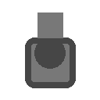

<p align="center">
  
</p>

<h1 align="center">📷 Full Page Screen Capture</h1>

<p align="center">
  <strong>Capture full-page screenshots — reliably, with minimal permissions, and no ads.</strong>
</p>

<p align="center">
  
  
  
  
</p>

<p align="center">
  Click the extension icon (or press <code>Alt+Shift+P</code>), watch each part of the page get captured,<br/>
  and open a <strong>result tab</strong> where you can download <strong>PNG / JPEG / PDF</strong> or edit the screenshot.
</p>

---

## 👨‍💻 Developer

<table>
  <tr>
    <td width="48">👤</td>
    <td>
      <strong>Flavio Paulino</strong><br/>
      Founder, <a href="https://tripaulx.com">tripaulx.com</a><br/>
      ✉️ <a href="mailto:flvp@me.com">flvp@me.com</a>
    </td>
  </tr>
</table>

### 🤖 Built with

This extension was implemented using **Grok Build** and **Composer 2.5** as AI-assisted development tools during execution, under the direction of Flavio Paulino.

---

## ✨ Features

| | Feature |
|:---:|:---|
| 🖱️ | **One-click full-page capture** from the toolbar icon or keyboard shortcut |
| 🧩 | **Scroll-and-stitch engine** that assembles the entire page into a single image |
| 🎯 | **Advanced page handling** for fixed headers, inner scroll regions, and same-origin iframes |
| ✂️ | **Automatic image splitting** when a page exceeds Chrome canvas limits |
| 🖼️ | **Result tab** with download, PDF export, edit, delete, copy, and issue reporting |
| 🎨 | **Built-in editor** with crop, shapes, highlight, text, emojis, browser frame overlays, undo/redo, and drag-to-move |
| 📤 | **Configurable exports** — PNG, JPEG, PDF (A4, Letter, Legal, A3), auto-download, smart PDF splitting |
| 🔒 | **Minimal permissions** — no `host_permissions`; uses `activeTab` only when you invoke the extension |
| 🌍 | **Internationalization** — 6 languages supported |

---

## 🌐 Supported languages

<p align="center">
  
  
  
  
  
  
</p>

| 🏳️ Locale | 🗣️ Language | 📁 Folder |
|:---:|:---|:---|
| `en` | 🇺🇸 English *(default)* | `_locales/en/` |
| `pt_BR` | 🇧🇷 Português (Brasil) | `_locales/pt_BR/` |
| `es` | 🇪🇸 Español | `_locales/es/` |
| `hi` | 🇮🇳 हिन्दी (Hindi) | `_locales/hi/` |
| `fr` | 🇫🇷 Français | `_locales/fr/` |
| `it` | 🇮🇹 Italiano | `_locales/it/` |

> 💡 Chrome picks the language automatically from your browser settings. UI strings live in [`_locales/`](_locales/).

---

## 📦 Installation (development)

```
1️⃣  Open chrome://extensions
2️⃣  Enable Developer mode
3️⃣  Click Load unpacked
4️⃣  Select this folder: full-page-screen-capture
```

✅ **No build step required.**

---

## 🚀 Usage

### 📸 Capture a page

| Step | Action |
|:---:|:---|
| 1️⃣ | Open any normal web page (`http`, `https`, `ftp`, or `file`) |
| 2️⃣ | Click the **Full Page Screen Capture** icon in the toolbar |
| 3️⃣ | Or press **`Alt+Shift+P`** *(may vary by platform)* |
| 4️⃣ | Wait for the progress popup to finish |
| 5️⃣ | A **result tab** opens with your full-page screenshot |

### 🛠️ Result tab actions

| Icon | Action | Description |
|:---:|:---|:---|
| ✏️ | **Edit** | Open the annotation editor |
| 📄 | **PDF** | Export to PDF with smart page splitting |
| ⬇️ | **Download** | Save as PNG or JPEG *(per options)* |
| 📋 | **Copy** | Copy image to clipboard *(via menu)* |
| 🗑️ | **Delete** | Remove capture and close tab |
| 🐛 | **Report** | Send issue report via email |
| ⚙️ | **Settings** | Open extension options |

> 💡 You can also **drag** the image to your desktop, or press `Cmd/Ctrl+S` to save.

### 🎨 Editor

| Tool | How to use |
|:---|:---|
| 🖱️ **Select** | Click and drag emojis, shapes, or text to reposition |
| ✂️ **Crop** | Click and drag a region to crop |
| 🖍️ **Highlight** | Drag a yellow highlight box |
| 🔤 **Text** | Click to add text |
| ⬜ **Shapes** | Choose Rectangle, Arrow, Circle, or Freehand, then drag on the image |
| 😀 **Emojis** | Pick an emoji, then click on the image to place it |
| ❌ **Delete** | Right-click an element → **Delete** *(or press `Delete` / `Backspace` when selected)* |
| 💾 **Export** | Download the edited screenshot with optional browser frame and URL overlay |

---

## ⚙️ Options

Open via the gear icon on the result tab, or `chrome://extensions` → **Extension options**.

| Section | Settings |
|:---|:---|
| 🖼️ **Image export** | PNG/JPEG format, JPEG quality, auto-download, Save As dialog |
| 📄 **PDF export** | Paper size, orientation, smart page splitting |
| 🎨 **Editor defaults** | Browser frame style, URL placement, date stamp |
| 🔧 **General** | Show welcome page on install |

---

## 🔐 Permissions

| Permission | Why |
|:---|:---|
| `activeTab` | 🔑 Temporary access to the current tab when you click the icon or use the shortcut |
| `scripting` | 💉 Inject scroll-and-capture scripts on demand |
| `storage` / `unlimitedStorage` | 💾 Save options and capture metadata |
| `offscreen` | 🧵 Stitch large images off the main UI thread |
| `downloads` *(optional)* | ⬇️ Native download dialog when enabled |

<p align="center">
  
</p>

---

## 🏗️ Architecture

```
👆 User click / Alt+Shift+P
        ↓
   🪟 Popup (capture orchestration + activeTab)
        ↓
 📜 Content script (scroll grid, fixed elements, iframes)
        ↓
 📷 captureVisibleTab (rate-limited, ~2/sec)
        ↓
 🧵 Offscreen document (canvas stitch)
        ↓
 💾 IndexedDB storage → 🖼️ Result tab → ✏️ Editor / 📄 PDF / ⬇️ Download
```

### 📁 Project structure

```
full-page-screen-capture/
├── 🌍 _locales/          # en, pt_BR, es, hi, fr, it
├── 🎨 icons/
├── 📋 manifest.json
├── src/
│   ├── background/    # MV3 service worker, capture orchestrator
│   ├── capture/       # Injected scroll & page-handling scripts
│   ├── stitch/        # Canvas stitching & image splitting
│   ├── offscreen/     # Offscreen stitch worker
│   ├── popup/         # Capture progress UI
│   ├── result/        # Result tab
│   ├── editor/        # Annotation editor
│   ├── options/       # Settings page
│   ├── export/        # PNG, JPEG, PDF export
│   ├── welcome/       # First-install welcome page
│   └── shared/        # i18n, storage, messaging, constants
└── 📖 README.md
```

---

## 🚫 Restricted pages

The extension **cannot** capture:

- ❌ `chrome://` pages *(Web Store, settings, etc.)*
- ❌ `chrome-extension://` pages
- ❌ Other restricted browser internal URLs

> 🔄 Reload the target page if capture fails after installing the extension.

---

## 🔧 Troubleshooting

| ⚠️ Issue | ✅ Solution |
|:---|:---|
| "Something went wrong" on capture | Reload the page, then try again. Check the error detail in the popup. |
| Quota / rate limit errors | The extension throttles captures to respect Chrome limits. Wait and retry. |
| PDF fails on very long pages | Use PNG export; PDF is limited to 200 pages. |
| Editor shapes not visible | Make sure to **click and drag** on the image after selecting a shape. |
| Language not changing | Set Chrome's preferred language in `chrome://settings/languages` and reload the extension. |

---

## 🙏 Credits & attribution

### 💡 Algorithm inspiration

Capture scroll-and-stitch logic is inspired by the MIT-licensed open source project:

**[mrcoles/full-page-screen-capture-chrome-extension](https://github.com/mrcoles/full-page-screen-capture-chrome-extension)**

### 👥 Development

| Role | Detail |
|:---|:---|
| 👨‍💻 **Developer** | Flavio Paulino — [tripaulx.com](https://tripaulx.com) |
| ✉️ **Contact** | [flvp@me.com](mailto:flvp@me.com) |
| 🤖 **AI tooling** | Grok Build, Composer 2.5 |

---

## 🛡️ Security

See [SECURITY.md](SECURITY.md) for the security model, what data stays local, and how to report issues.

**Pre-publish audit summary:**

| Status | Item |
|:---:|:---|
| ✅ | No API keys, tokens, passwords, or private keys in the codebase |
| ✅ | No remote telemetry or third-party analytics endpoints |
| ✅ | No `host_permissions` — least-privilege `activeTab` model |
| ✅ | Issue reports use `mailto:` only; user chooses what to send |
| 📦 | Third-party dependency: [jsPDF](https://github.com/parallax/jsPDF) *(bundled in `src/vendor/`, MIT license)* |

---

## 📜 License

Released under the [MIT License](LICENSE).

This project builds upon concepts from the MIT-licensed [full-page-screen-capture-chrome-extension](https://github.com/mrcoles/full-page-screen-capture-chrome-extension) by Peter Coles.

---

## 📋 Changelog

### 1.0.1

- 🌍 Added Hindi (`hi`), French (`fr`), and Italian (`it`) translations
- 📖 Visual README refresh with badges, emojis, and color accents

### 1.0.0

- 🎉 Initial release
- 📷 Full-page capture with MV3, offscreen stitching, result tab, PDF export, editor
- 🌍 Internationalization: English, Portuguese (Brazil), Spanish
- ⏱️ Rate-limited capture for Chrome quota compliance
- 🎨 Editor: shapes, emojis, drag, right-click delete